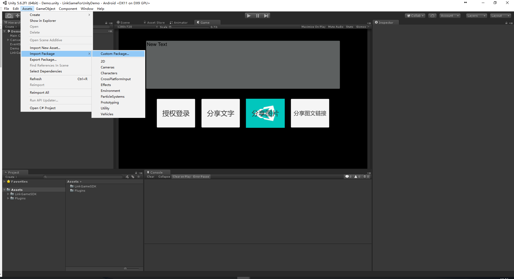
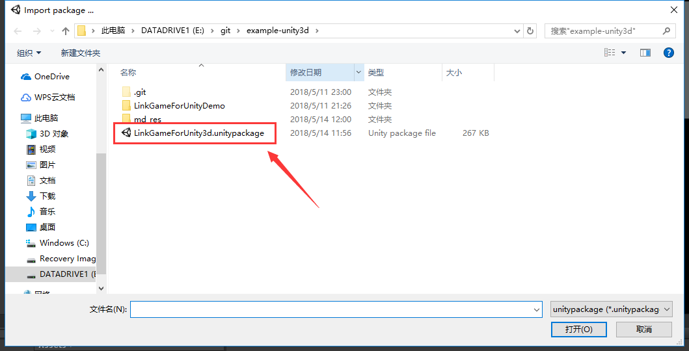
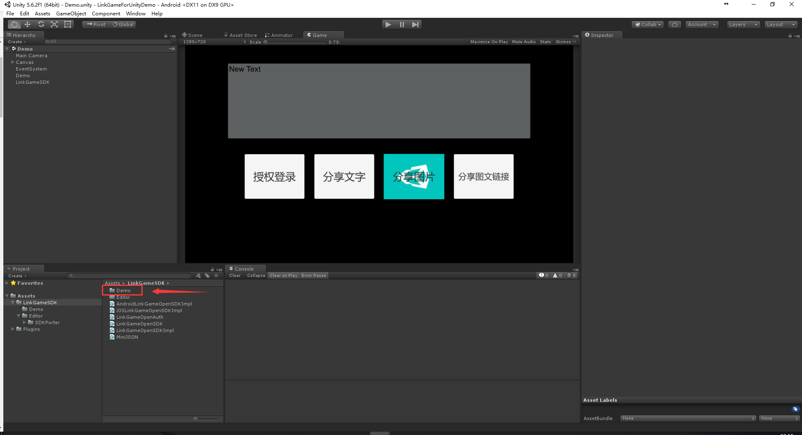
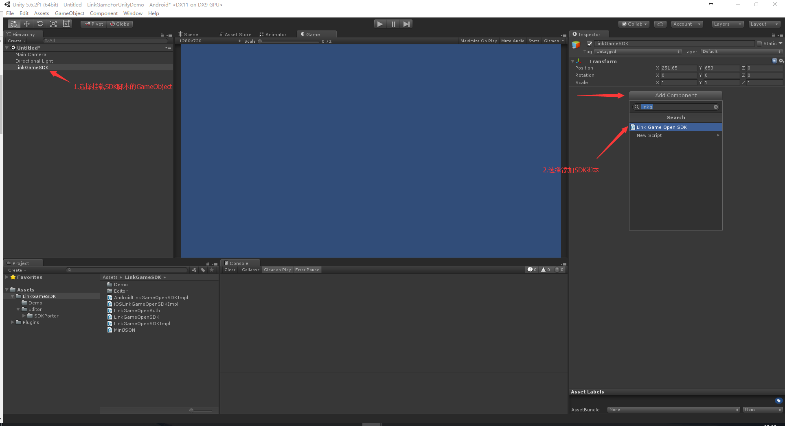
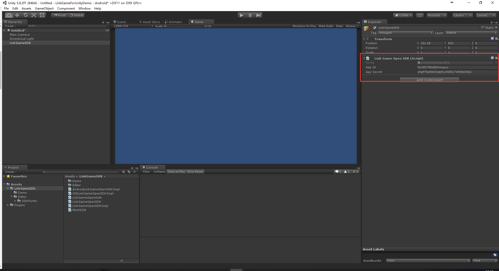
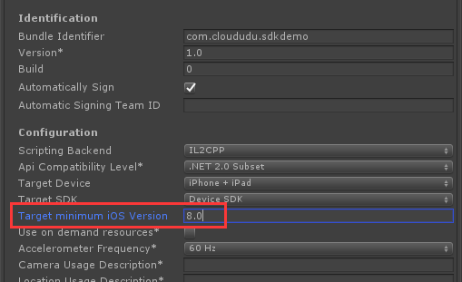
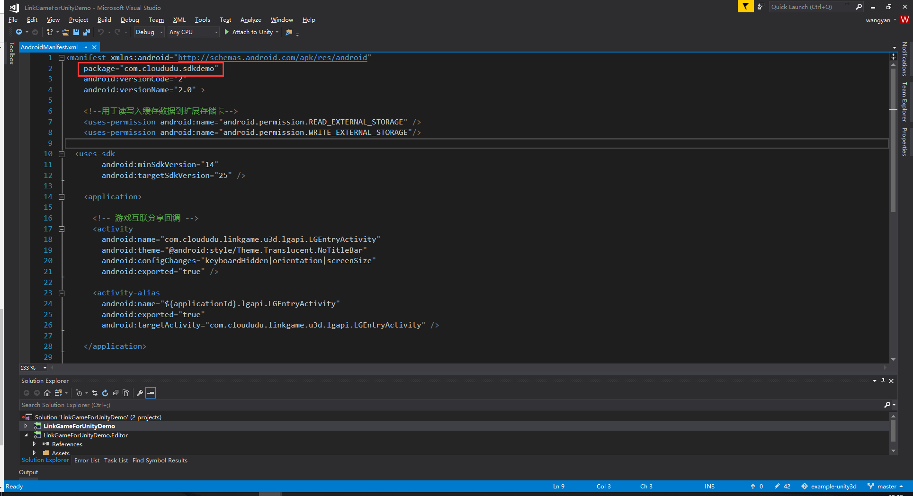
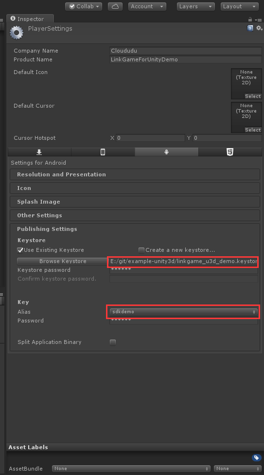

# example-unity3d
游戏互联Unity3d SDK接入示例

- UnitySDK示例基于 Unity5.x 版本  开发, 可快速集成
- 集成包已包含IOS和Android双平台环境快速集成!

# 准备工作

如下图,导入集成SDK包



可在LinkGameSDK->Demo目录下快速体验SDK接口功能


# 配置SDK脚本

如下图添加挂载SDK脚本


挂载后可直接配置AppId与AppSecret

也可以在LinkGameOpenSDK.cs代码中接直接更改
```
public string AppId = "0124578befjklmopuy";
public string AppSecret = "e9af7fa05833abf1296fb274fd5b0582";
```

# iOS
导出iOS平台XCode项目时需要配置白名单以及AppID,之后会自动配置到导出的XCode项目中
- 配置代码文件 LinkGameSDK->Editor->SDKPorter->LinkGameSDKPostProcessBuild.cs
- 将`linakgme`加入Scheme白名单
- ​将`lg+AppID`配置到`CFBundleURLSchemes`中
```
	private static void EditInfoPlist(string projPath)
    {
		XCPlist plist = new XCPlist (projPath);

		//URL Scheme 添加
		string PlistAdd = @"  
            <key>CFBundleURLTypes</key>
			<array>
                <dict>
                  <key>CFBundleURLSchemes</key>
                  <array>
                    <string>lg0124578befjklmopuy</string>
                  </array>
                  <key>CFBundleURLName</key>
                  <string>linkGameApp</string>
                </dict>
			</array>";

		//白名单添加
		string LSAdd = @"
		<key>LSApplicationQueriesSchemes</key>
		<array>
			<string>linkgame</string>
		</array>";


		//在plist里面增加一行
		plist.AddKey(PlistAdd);
		plist.AddKey (LSAdd);
		plist.Save();
	}
```
- iOS miniNum version 为8.0
  
# Android

- Android项目只需修改Plugins->Android->LinkGameSDK->AndroidManifest配置文件中的包名即可,与自己的项目包名对应
  
- 打包DemoAPK需要引用linkgame_u3d_demo.keystore文件,密码:123456
  